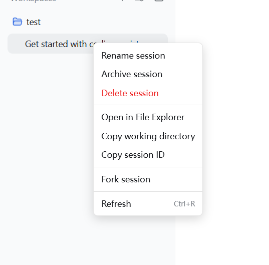
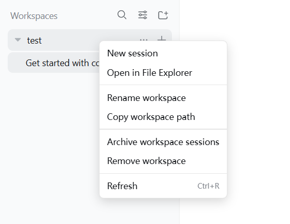
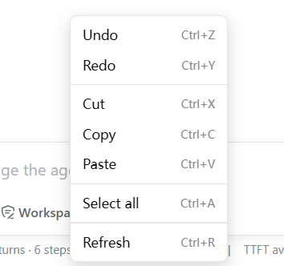
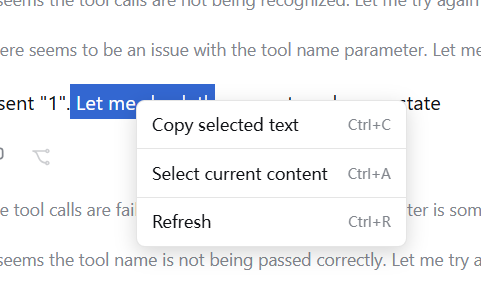

# Better Context Menu

> Better Context Menu for DeepSeek Harness

[简体中文](README.md) | English

> [!WARNING]
> **The current version does not target the native Web experience.** This plugin is intended for desktop wrappers that host the DeepSeek Harness Web UI, including Tauri, EAC, Electron, WebView2, CEF, and Qt WebEngine. Opening `dsh web` directly in Chrome, Edge, Firefox, or another regular browser is outside the current support scope, and native browser context-menu behavior is not a compatibility target.

Better Context Menu provides a fuller, desktop-style right-click experience for DeepSeek Harness wrappers. It covers sessions, workspaces, settings, conversation content, links, and text inputs. Menu and notification text supports Chinese and English and automatically follows the host UI language. Existing official session actions are delegated to official components; the plugin additionally provides permanent session deletion with confirmation and path safeguards.

## Installation

DeepSeek Harness and a Profile that hosts the Web UI, such as `web` or `tauri`, are required. Following the GitHub `main` branch is recommended for the latest features and straightforward updates:

```bash
dsh plugin --profile web add github:baihejiangnan/dsh-session-context-menu
```

To remain on the latest stable tag instead of following later updates:

```bash
dsh plugin --profile web add github:baihejiangnan/dsh-session-context-menu#v0.2.14
```

Restart `dsh web` or the Tauri, EAC, or other desktop wrapper after installation. Developers can also clone the repository and link a local checkout:

```bash
git clone https://github.com/baihejiangnan/dsh-session-context-menu.git
dsh plugin --profile web add ./dsh-session-context-menu
```

The latest stable tag is `v0.2.14`. The `main` branch already contains Chinese/English localization and permanent session deletion planned for the next release.

### Updating

For an installation that follows the unpinned GitHub source, fetch the latest `main` version with:

```bash
dsh plugin --profile web up @baihejiangnan/dsh-session-context-menu
```

Restart `dsh web` or the desktop wrapper after updating. Users pinned to a tag such as `#v0.2.14` must change the dependency target to a newer tag or rerun the corresponding installation command.

### Uninstalling

```bash
dsh plugin --profile web remove @baihejiangnan/dsh-session-context-menu
```

## Screenshots

### Sessions and workspaces

<table>
  <tr>
    <td width="34%" align="center"><strong>Session context menu</strong></td>
    <td width="66%" align="center"><strong>Workspace context menu</strong></td>
  </tr>
  <tr>
    <td></td>
    <td></td>
  </tr>
</table>

### Conversation input



### Output content



## Built-in contexts

- Sessions: official rename, fork, and archive actions; permanent deletion; open directory; copy directory and session ID.
- Workspaces and their New Session rows: create session, open directory, rename, copy path, archive workspace sessions, and safely remove the workspace registration.
- Plain text: copy selected text; Select All is strictly scoped to the current conversation-content slot or settings dialog and never includes the application sidebar.
- Links and selected URLs: open with the system default browser and copy the link.
- Inputs: undo, redo, cut, copy, paste, and select all.
- Every plugin menu: refresh the current Harness page.

## Compatibility strategy

- Does not modify `@deepseek-ai/*`, the Tauri shell, or other community plugins.
- Resolves targets through accessibility semantics on session rows and uses the public `sessions` and `workspaces` services for ordinary operations. If a target cannot be identified safely, the browser's default menu is left intact.
- Ordinary actions continue to use public Harness services. Permanent deletion uses a plugin host route because Harness currently exposes archive but no session-deletion RPC.
- Uninstalling the plugin leaves no patches behind.
- **Coexists with dsh-better-sidebar** (`v0.2.14+`): better-sidebar wraps the host's `workspaces.openPath` and directs every path to its sidebar editor. To prevent a directory from being treated as a file and failing with `xxx is a directory`, this plugin's Open in File Explorer action calls the host `host.openPath` RPC directly through `POST /api/host.openPath`. URLs never enter the filesystem-path API; the desktop wrapper's external-navigation handler sends them to the system default browser.

## Permanent session deletion

> [!CAUTION]
> Permanent deletion cannot be undone. Confirmation removes the session log, co-located attachments, projection cache, and workspace accounting.

- Delete session opens a plugin-owned confirmation dialog. Only the explicit Delete button continues; Cancel, clicking the backdrop, or pressing `Escape` cancels the operation.
- For a running session, the plugin first cancels the task, waits for the Agent to stop, and detaches the live session so the log cannot be recreated in the background.
- Deleting the currently viewed session moves the content area to the same default state as the top-level New Session action. Deleting another session leaves the current content unchanged.
- Recursive deletion is restricted to a JSONL session directory below the active `DSH_HOME/sessions` root whose directory name exactly matches the session ID.
- The host deletion endpoint accepts same-origin JSON requests only and rejects cross-origin or malformed calls.

## Changelog

### Unreleased (`main`)

- **Added:** Chinese and English menu, toast, confirmation, and error text that follows the host UI language.
- **Added:** Permanent deletion in the session menu, including a custom danger confirmation dialog, live Agent shutdown, on-disk path validation, and projection/workspace cleanup.
- **Behavior:** Deleting the current session enters the default New Session state; deleting a non-current session preserves the current content area.
- **Security:** Restricted recursive deletion targets and rejected cross-origin or non-JSON deletion calls.
- **Fixed:** Open in default browser no longer passes URLs to PowerShell as filesystem paths on Windows.

### v0.2.14 (2026-08-18)

- **Fixed:** Open in File Explorer failed with `xxx is a directory` when coexisting with `dsh-better-sidebar`. Directory opening now uses the host `host.openPath` RPC and bypasses better-sidebar's `workspaces.openPath` wrapper; link behavior is unchanged.

### v0.2.13

- Complete context menus for sessions, workspaces, settings, conversation content, links, and inputs.

## GitHub Topics

This repository uses the `dsh-plugin` topic so public releases are aggregated at [`github.com/topics/dsh-plugin`](https://github.com/topics/dsh-plugin). It also uses topics such as `deepseek-harness`, `context-menu`, `tauri`, and `webview` to describe its purpose and runtime environment.

## Why there is no Pin Session action

Codex pinning is not simply moving one row to the top. It is driven by independent pin state: pinned conversations stay in a pinned section while unpinned conversations continue to sort by recent activity. New messages, updates, and restarts therefore do not remove the pin or disturb the time ordering of other sessions.

DeepSeek Harness currently exposes no equivalent `pinned` field, pin collection, pin RPC, or state-change event. Its sidebar provides only two global ordering modes:

- **Recent activity:** every session is reordered by activity time. Even if a plugin calls `workspaces.insertSessionBefore()` to move a session to the top of its workspace ordering, the sidebar recalculates display order from timestamps.
- **Manual ordering:** a session can be moved to the top, but the entire session list then stops sorting automatically by recent activity. This is not equivalent to pinning one session while all others remain time-sorted.

For that reason, this plugin does not offer Pin Session and does not simulate it by changing the global ordering mode, directly editing Harness storage, rearranging the React DOM, or rewriting session logs. Those approaches alter the user's ordering preference and are fragile across Tauri, EAC, search results, and Harness versions.

If Harness later exposes independent pin state and public operations, the plugin can integrate genuine pinning without interfering with ordinary time-based sorting.

## Extension protocol

Other Web plugins can register extension entries through the global registry. `run` executes when the entry is selected, while `visible` can decide whether the entry appears for a session:

```js
const menu = globalThis[Symbol.for('dsh.session-context-menu.extensions')]
const dispose = menu.register({
  id: 'example.session-details',
  order: 100,
  label: 'Session details',
  visible: ({ session }) => Boolean(session),
  run: ({ session }) => console.log(session),
})
```

Opening a context menu also dispatches a `dsh:session-context-menu` event. Its `detail` contains `row`, the official menu `action`, `session`, the original `target`, pointer coordinates `x/y`, and current `extensions`. Extension plugins should call the disposer returned by `register` when they unload.

## Compatibility notes

- If sessions with identical names cannot be distinguished through the public DOM semantics, the plugin does not take over that row's browser menu, preventing actions from targeting the wrong session.
- If Clipboard API writes are unavailable, copying falls back to the browser copy command. If the host blocks clipboard reads, the plugin asks the user to use `Ctrl+V`.
- Undo and redo depend on host-editor support. If they cannot be invoked from the menu, the plugin asks the user to use the corresponding keyboard shortcut.
